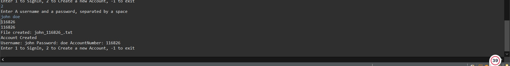
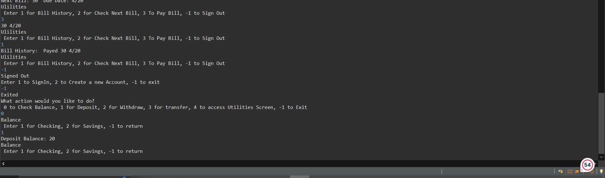

# 317_lab6

How To Use our project

1. Run Interface.java

  It will pop up with on the console to enter a username, This would be the username for a bank. This is to support multiple bank users

When a user enters their username, it will open a menu with options they can choose from

By Selecting 0, they can check the balance of one of their accounts, the can select the account the want to view

By Selecting 1, it will prompt the user to enter which account the will like to deposit into, them prompt user to enter amount

By Selecting 2, it will prompt the user to enter which account the will like to withdraw from, 

By Selecting 3, it will prompt the user to enter the transfer mode 

By Selecting 4, It will chang eto the utilies screen, In the utilities screen

  In Utilities, a user can either sign in, or create an account

  After the sign in they can view their past bill, check current bill , or pay their current bill

